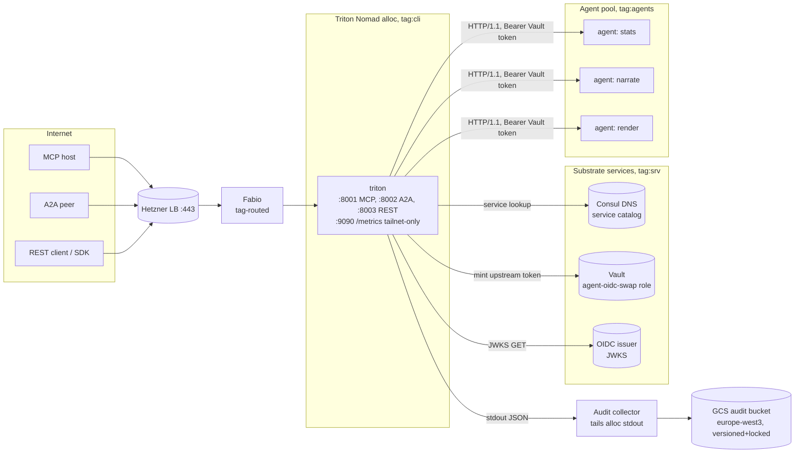
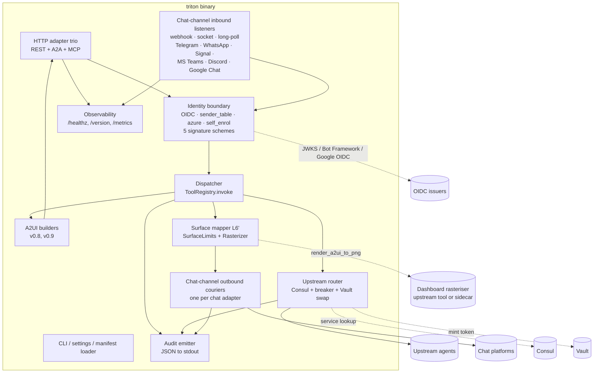
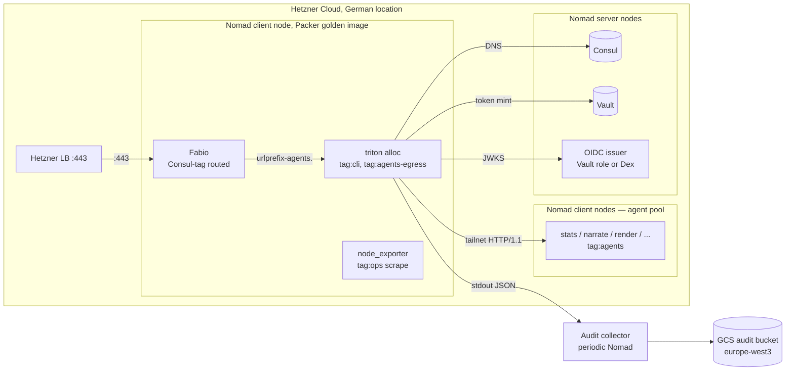

# Triton — Architecture (arc42)

Status: draft v0.2 (2026-05-23)
Companion to `requirements.md` and `realizations.md` in this
directory.

This is a high-level design. The coding agent has freedom on
implementation details not pinned here. Where a decision is fixed,
an ADR in §9 says so and cites the constraint that fixed it.

v0.2 absorbs the **chat-channel extension** specified by the
follow-up paper at `2026-05-23-triton-messengers/`. The original
three HTTP adapters (MCP, A2A, REST) remain in scope unchanged;
six chat-channel adapters (Telegram, WhatsApp Web, Signal, MS
Teams, Discord, Google Chat) are added alongside, with the
structural extensions catalogued throughout this document and
ADRs 11–15 below. Every claim that the v0.1 draft made about the
"three adapters" is now read as "the HTTP adapter trio"; chat
channels are first-class citizens of the same dispatcher and
audit pipeline.

---

## 1. Introduction and goals

Triton is the public agent-ingress gateway of the Hetzner agent
substrate v2. A single Rust binary exposes **nine adapters** — the
HTTP trio (MCP, A2A, REST) on three TCP listeners, plus six
chat-channel adapters (Telegram, WhatsApp Web, Signal, MS Teams,
Discord, Google Chat) added in v0.2 — verifies inbound credentials
through the appropriate identity-resolution strategy, and
dispatches each tool call to an upstream agent discovered via
Consul.

Top quality goals, in priority order:

1. **Audit symmetry.** All adapters funnel through one
   dispatcher; every call produces an audit pair — the inbound
   record (dispatcher at receipt) and the outbound record
   (upstream router for HTTP adapters; chat-channel courier for
   v0.2 adapters) — linked by `trace_id`. Cross-protocol and
   cross-channel observability is by construction, not by
   retrofit.
2. **Parity.** A2UI envelopes returned across HTTP protocols are
   semantically identical for the same input. Parity tests compare
   parsed dicts. For chat-channel adapters in v0.2, the analogous
   property is *equivalence under the manifest's `degrade` rules*
   (M-MAP-1 / M-PARITY-MULTI-1 in the follow-up paper); the
   `PlatformMessage` emitted by the surface mapper is byte-equal
   across adapters.
3. **Statelessness.** No user data persists across restarts.
   Blue/green canary promotion is safe by construction; cattle nodes
   come up clean.

## 2. Constraints

| # | Constraint | Source |
|---|---|---|
| C-1 | Public surface only via Fabio on `:443`; adapter ports not directly exposed. | Substrate §2 invariant 2; G-7 / G-S6 |
| C-2 | No static cloud credentials anywhere in the binary or its environment. | Substrate §2 invariant 3 |
| C-3 | Single Rust static binary baked into the Packer golden image; Rust-only golden-image baseline. | G-6, G-S4 |
| C-4 | OIDC verification against substrate identity issuer; upstream calls use Vault-minted short-lived tokens. | G-2, G-10b, G-S1, G-S7 |
| C-5 | Stateless across restarts; in-flight drain on SIGTERM for blue/green canary. | G-4, G-8 |
| C-6 | Audit lines to stdout; substrate audit-collector ships them to GCS. No self-hosted log shipper. | G-3, G-13, G-S3 |
| C-7 | Upstream agents discovered via Consul `tag:agent:<name>`; no static endpoint config. | G-9 |
| C-8 | Tailscale ACL: only Triton (`tag:cli`) reaches `tag:agents`. | G-S5 |
| C-9 | A2UI v0.8 and v0.9 are both supported; clients select via content negotiation. | Python experiment H-VERSION-1 |
| C-10 | Chat-channel adapters (v0.2) own platform credentials (bot tokens, session keys, service-account JSON, Azure-managed identity). All such credentials MUST be Vault references in production; literal values are admitted in dev only with a runtime warning. | Messenger paper §6 (declarative manifests); M-SECRETS-1 |
| C-11 | The Signal adapter MUST refuse to start if its configured signal-cli bridge endpoint does not resolve to a loopback address; the bridge is the boundary at which Signal end-to-end encryption terminates. | Messenger paper §5 (Signal); M-LOCALITY-1 |
| C-12 | The deployment YAML manifest (`adapter.yaml`) is the single source of truth for adapter wiring, tool registration, identity strategies, surface mapping rules, and rate-limit budgets. Boot-time validation closed-checks every kind / degrade key against the documented set. | Messenger paper §6, §Appendix; M-MANIFEST-1, M-COVERAGE-1 |

## 3. Context and scope



**External actors**: MCP hosts, A2A peers, REST/SDK clients, the
substrate identity issuer, Consul, Vault, the audit-collector, the
agent pool. **v0.2 adds**: Telegram, WhatsApp, Signal (via the
signal-cli daemon running as a substrate sidecar), Microsoft Teams
(via the Bot Framework Connector service), Discord (Gateway
WebSocket plus the signed Interactions HTTPS endpoint), and Google
Chat (HTTPS webhook with Google OIDC service-account JWT).

**System boundary**: the single `triton` binary in one Nomad
allocation. Fabio, Consul, Vault, the agent pool, the audit
collector, and the OIDC issuer are external. The signal-cli bridge
process is co-located with the Triton allocation on the same host
(constraint C-11) and treated as substrate-managed, not internal
to the binary. The dashboard rasteriser (v0.2, §5.2 and §8.7) is
external: an upstream tool named `render_a2ui_to_png` or a
sidecar service reached through the upstream router.

## 4. Solution strategy

| Decision | Rationale |
|---|---|
| **Three HTTP TCP listeners in one process** (MCP, A2A, REST), plus a configurable set of chat-channel listeners (v0.2). | Matches both experiments for the HTTP trio. Chat channels add an inbound listener per adapter selected from three shapes (HTTP webhook, persistent socket, long-poll). Preserves protocol isolation; per-protocol rate-limit and ACL policies become possible without inter-protocol coupling. |
| **Adapter ring splits inbound listener + outbound courier for chat channels** (v0.2). | The HTTP trio's request/response shape is synchronous; chat channels separate the inbound ack from the outbound platform call. The dispatcher sits between the two halves and remains the single audit pivot. |
| **Surface mapper at L6′ + per-adapter `degrade` rule table** (v0.2). | One mapper, six adapter-specific projections: text-only at the left (Signal, WhatsApp Web, Google Chat) through inline keyboards (Telegram, Discord components v2) to lossless Adaptive Cards (Teams). The dispatcher emits a canonical A2UI envelope; the mapper consumes the per-adapter rule table to project. |
| **Declarative YAML manifest as the single configuration substrate** (v0.2). | `adapter.yaml` subsumes the hardcoded tool registry and adapter wiring. Boot-time validation closed-checks every kind / signature / identity / degrade key. Vault references for all credentials. |
| **One central dispatcher** as the audit pivot. Adapters are unwrap/wrap shells with no business logic and no audit emission. | Audit symmetry erodes first in multi-protocol systems when adapters carry logic. Python experiment finding; constraint of the spec. |
| **Adapters ~100–200 LOC each.** | Any growth past this size is a smell that business logic is leaking out of the dispatcher. |
| **OIDC at the identity boundary; Vault-minted short-lived tokens for upstreams.** | Lethal-trifecta cut. Triton cannot hold ambient credentials it could leak to a compromised upstream. |
| **Consul tag-driven discovery of agents.** | Adding/removing an agent is a Nomad job push, not a Triton config push. Symmetric with how Fabio discovers Triton. |
| **Per-tool circuit-breaker with timeout budget.** | A slow agent must not wedge a worker pool. Isolation is per-tool, not per-process. |
| **A2UI v0.8 and v0.9 emitted by separate builders, no shared base.** | Schema evolution stays compartmentalised. The dispatcher and tools never branch on version. Python experiment finding. |
| **Hand-rolled MCP JSON-RPC over axum; no `rmcp`/`tonic`.** | Rust experiment finding: simpler, faster to ship, no framework lock-in for a thin protocol layer. |
| **Stdout audit; substrate ships it.** | No Loki/Vector/OTel exporter dependency in the binary. Matches G-S3 division of labour. |
| **Single static Rust binary, baked into golden image.** | Matches G-S4 / Δ-4 substrate baseline. No Python runtime, no Node, no shared libs beyond libc. |
| **Public test-harness surface, no `mock` doubles.** The same `crates/triton-tests` fixtures that drive Triton's own integration tests are the supported consumer-facing test surface. External apps depend on the crate via path/git, instantiate the real fakes (Consul / Vault / OIDC / agent), and spawn the real binary. | Mirrors CLAUDE.md §1: "no mocks" means real local servers speaking the actual wire protocol. The discipline that keeps Triton's internal tests honest also gives consumers a zero-mock test pattern by reuse. Avoids a parallel mock layer that would inevitably diverge from production behaviour. |

## 5. Building-block view

### 5.1 Level 1 (whitebox `triton`)



### 5.2 Level 2 building blocks

| Block | Responsibility | Reference (Python / Rust) |
|---|---|---|
| **CLI / settings / manifest loader** | Entrypoint; parses CLI flags and `TRITON_*` env into a single `Settings`; **loads `adapter.yaml` and validates every closed set at boot** (v0.2). Boots the HTTP server trio under `tokio::select!` plus a per-chat-adapter listener task plus a signal handler. | `2026-05-15-triton/triton/cli.py`, `2026-05-15-triton/triton/settings.py`, `2026-05-16-triton-rust/src/cli.rs`, `2026-05-16-triton-rust/src/settings.rs`; v0.2 manifest loader at `2026-05-23-triton-messengers-impl/crates/triton-chat-surface/src/manifest.rs`. |
| **HTTP adapter trio** | Three thin per-protocol routers (MCP, A2A, REST). **The only layer that knows the HTTP wire formats.** Each unwraps to `(tool, args, principal, trace_id, a2ui_version)` and wraps the response. ~100–200 LOC each. | `2026-05-15-triton/triton/adapters/{rest,a2a,mcp}.py`, `2026-05-16-triton-rust/src/adapters/{rest,a2a,mcp}.rs` |
| **Chat-channel inbound listeners** (v0.2) | One listener per chat adapter, three realisations selected by manifest: HTTP webhook (Telegram, MS Teams, Discord Interactions, Google Chat), persistent socket (WhatsApp Web, Discord Gateway, Signal-cli daemon), long-poll worker (Telegram alternative mode). Each verifies the platform-side signature (closed set per FR-I-Y), resolves the platform sender to a `Principal` via the per-adapter identity strategy, and acks the platform within its retry budget before handing the invocation to the dispatcher. | `2026-05-23-triton-messengers-impl/crates/chat-adapter-{telegram,discord,signal,...}/src/lib.rs`; trait shapes at `crates/triton-chat-surface/src/transport.rs`. |
| **Identity boundary** | Verifier ring producing `Principal{sub, scopes, tenant, raw_token, trace_id}`. The HTTP trio uses OIDC + JWKS (per-`kid` cache, rate-limited refresh). v0.2 chat-channel adapters select one of four resolution strategies per manifest: `sender_table` (Telegram, Discord, WhatsApp, Signal), `azure` (MS Teams via AAD), `self_enrol` (Google Chat pairing flow), `upstream` (delegated to a resolver tool). Platform signature checks (`hmac256`, `bot_framework_jwt`, `ed25519`, `google_oidc_jwt`, session-locality) gate the inbound *before* payload parsing. | `2026-05-15-triton/triton/identity.py`, `2026-05-16-triton-rust/src/identity.rs`; v0.2 strategy discriminator in the manifest loader. |
| **Dispatcher** | `ToolRegistry::invoke(tool, args, principal) -> Result`. Argument validation, timing, audit emission, four typed error variants (`Auth`, `Validation`, `Tool`, `Provider`). The single bottleneck every protocol funnels through. In v0.2 the dispatcher does not change shape; chat-channel invocations enter it through the inbound listener, exactly like HTTP invocations. | `2026-05-15-triton/triton/dispatcher.py`, `2026-05-16-triton-rust/src/dispatcher.rs` |
| **Upstream router** | Resolves `agent:<tool>` via Consul; mints a per-call OIDC token via Vault role `agent-oidc-swap`; applies per-tool timeout + circuit-breaker (closed/open/half-open); dispatches HTTP/1.1 to the chosen agent on the tailnet. Wraps raw upstream JSON into A2UI; passes pre-shaped A2UI through. | **New in production** — neither experiment has upstreams; tools were in-process. Design follows G-9/G-10b/G-11/G-12. |
| **A2UI builders** | One builder per version, no shared base. v0.8: PascalCase `ComponentWrapper` oneof. v0.9: flat-component shape. Content-negotiation helper parses `Accept` / message metadata. | `2026-05-15-triton/triton/ui/{builder,builder_v09,a2ui}.py`, `2026-05-16-triton-rust/src/ui/{builder,builder_v09,a2ui}.rs` |
| **Surface mapper (L6′)** (v0.2) | Stateless function from A2UI envelope + per-adapter `degrade` rule table to platform-neutral `PlatformMessage`. Enforces per-adapter surface caps (`SurfaceLimits::DISCORD` 25-item select cap, `TELEGRAM` 8-buttons-per-row, `WHATSAPP_WEB` 4000-char chunks); chunks oversize text, paginates oversize button rows, rejects oversize selects with `UnsupportedSurface`. Dashboard components are delegated to an injected `Rasterizer`. HMAC-signed correlation tokens (per-adapter `CorrelationKey`) are emitted on every button / selection option for follow-up event matching. | `2026-05-23-triton-messengers-impl/crates/triton-chat-surface/src/mapper.rs` (`EnvelopeMapper`, `SurfaceLimits`, `Rasterizer`, `correlation::{sign,verify}`). |
| **Chat-channel outbound couriers** (v0.2) | One courier per chat adapter. Consumes `PlatformMessage` fragments from the surface mapper, encodes them into platform-native bytes per the adapter's `degrade` rules, and posts to the platform's outbound substrate (Telegram `sendMessage`, Discord `/channels/.../messages`, the WhatsApp Web socket session, signal-cli RPC, Bot Connector REST, Google Chat REST). Holds the platform credential (Vault-referenced per C-10) and is the only component in the binary that does. Emits the second audit record per invocation, sharing `trace_id` with the dispatcher record. | `2026-05-23-triton-messengers-impl/crates/chat-adapter-{telegram,discord,signal,...}/src/lib.rs` (`*Courier`). |
| **Audit emitter** | Structured JSON lines to stdout. v0.1 callsites: dispatcher (one inbound line per invocation) and upstream router (one line per upstream dispatch). v0.2 adds the chat-channel courier as a third callsite — every chat-channel invocation emits a `AuditPhase::Dispatch` record from the dispatcher and a `AuditPhase::Post` record from the courier, sharing one `trace_id`. Inbound signature rejections produce an `AuditPhase::Rejected` record before the dispatcher is reached. | `2026-05-15-triton/triton/dispatcher.py` (reference fields), extended to the substrate audit schema; v0.2 phase discriminator in `crates/triton-chat-surface/src/audit.rs`. |
| **Dashboard rasteriser** (external dependency, v0.2) | Out-of-process renderer that consumes a dashboard subdocument and returns `{png_bytes, caption}`. Realised as either an upstream tool named `render_a2ui_to_png` (preferred: inherits identity + audit symmetry through the upstream router) or a peer Nomad job reached as a sidecar. The text-first adapters (Signal, WhatsApp Web, Telegram, Discord, Google Chat) emit `Fragment::Media` with the rendered PNG; MS Teams projects the same envelope onto an Adaptive Card `ColumnSet` natively and skips the rasteriser. | `2026-05-23-triton-messengers-impl/crates/triton-chat-surface/src/mapper.rs` (`Rasterizer` trait). |
| **Observability** | `/healthz`, `/version`, tailnet-only `/metrics`. Bound on the REST listener (well-known endpoints) plus a separate tailnet-only listener for `/metrics`. v0.2 metrics include per-adapter rate-limit budgets, inbound/outbound latencies, and surface-mapper cap-hit counters. | New; the experiments have only `/healthz`. |

## 6. Runtime view

### 6.1 Inbound tool call (steady state)

```
client → Fabio :443 → Triton :800{1,2,3}
  └─ adapter unwraps → (tool, args_json, raw_token, a2ui_version)
        └─ identity.verify(raw_token)
              ├─ JWKS cache hit / fetch
              ├─ verify signature, iss, aud, exp, nbf, alg ∈ allowlist
              └─ Principal{sub, scopes, tenant, raw_token, trace_id}
        └─ dispatcher.invoke(tool, args_json, principal)
              ├─ schema-validate args_json against tool descriptor
              ├─ start timer
              ├─ upstream_router.dispatch(tool, args, principal)
              │     ├─ consul.lookup("agent:" + tool) → endpoint
              │     ├─ circuit_breaker.guard(tool) → may short-circuit
              │     ├─ vault.mint("agent-oidc-swap", tenant=principal.tenant, ttl=5m)
              │     ├─ http POST endpoint, Bearer <vault_token>, body=args
              │     ├─ emit upstream audit line {trace_id, ...}
              │     └─ raw JSON | pre-shaped A2UI
              ├─ if A2UI requested and result is raw → A2UI builder wraps it
              ├─ stop timer; emit inbound audit line {trace_id, latency_ms, ...}
              └─ return envelope
  └─ adapter wraps response in wire format
```

### 6.2 SIGTERM drain

```
signal SIGTERM
  └─ stop accepting new connections on all three listeners
       (axum graceful shutdown; tower_http GracefulShutdown layer)
  └─ in-flight requests:
       - allowed to complete OR
       - hit per-request deadline (default 30 s) and return 503
  └─ flush stdout (audit lines)
  └─ exit 0
```

### 6.3 Circuit-breaker state machine (per tool)

```
closed   ──N consecutive timeouts──▶ open
open     ──cooldown elapsed──────────▶ half-open
half-open ──probe ok─────────────────▶ closed
half-open ──probe failed─────────────▶ open (reset cooldown)
```

While `open`, calls to the tool return `Tool{circuit_open}` within
one round-trip; other tools are unaffected.

### 6.4 Cold start

```
nomad alloc start
  └─ binary loads settings (CLI + env)
  └─ load adapter.yaml manifest; closed-check every kind /
       signature / identity / degrade key (M-MANIFEST-1);
       refuse to start on any failure
  └─ resolve every Vault credential reference in the manifest
       (bot tokens, webhook secrets, service-account JSON,
       Azure-managed identity); refuse to start on missing
       Vault secret (M-SECRETS-1)
  └─ for every chat-channel adapter, validate that every tool's
       declared `surface_components` has a `degrade` rule
       (M-COVERAGE-1); refuse to start on any missing rule
  └─ resolve substrate OIDC issuer URL
  └─ resolve Consul, Vault endpoints (Nomad-template or env)
  └─ bind three HTTP listeners; bind per-chat-channel listeners
       (webhook ports, persistent sockets, daemon sockets);
       bind tailnet metrics listener
  └─ for Signal adapter: refuse to start if bridge endpoint is
       non-loopback (M-LOCALITY-1)
  └─ /healthz returns 200
  └─ first inbound call:
       - JWKS / Bot Framework / Google OIDC cold-miss → fetch
       - Consul lookup cold-miss → fetch
       - Vault token mint (upstream router)
       - upstream dispatch
```

### 6.5 Chat-channel request lifecycle (v0.2)

```
platform → inbound listener (webhook | socket | long-poll)
  └─ verify platform signature (FR-I-Y closed set):
       secret_token | hmac256 | bot_framework_jwt |
       ed25519 | google_oidc_jwt | session-locality
       └─ on reject: emit AuditPhase::Rejected; return 401
  └─ resolve platform sender id to Principal via the
       per-adapter identity strategy (FR-I-X closed set):
       sender_table | azure | self_enrol | upstream
  └─ ack the platform within its retry budget
       (Telegram ≤ 60 s, MS Teams ≤ seconds, Discord
       Interactions ≤ 3 s with deferred-response,
       persistent sockets via socket-level backpressure)
  └─ dispatcher.invoke(tool, args, principal)
       (path identical to §6.1 from here onward)
  └─ emit AuditPhase::Dispatch record {trace_id, transport:
       "messenger:<adapter>", phase: "dispatch", status:
       "accepted"}
  └─ if outcome is A2UI envelope:
       surface mapper consumes the envelope + the adapter's
       degrade rule table → PlatformMessage
       (text + media + buttons + selections + forms);
       dashboard components delegated to the rasteriser
  └─ outbound courier encodes PlatformMessage per the
       adapter's degrade rules and posts to the platform
       outbound substrate
  └─ emit AuditPhase::Post record {trace_id, transport, phase:
       "post", status: posted | retry (5xx) | dropped (4xx)}

Event roundtrip (chat-channel button tap / slash command):
  the platform delivers a callback (callback_query for Telegram,
  message component interaction for Discord, Action.Submit for
  Teams, numbered-prompt reply text for Signal / WhatsApp Web /
  Google Chat); the inbound listener verifies the HMAC-suffixed
  correlation token, recovers the (tool, args) pair, and
  re-enters the dispatcher with a fresh trace_id. State lives
  only in the correlation token; no server-side conversation
  state is held.
```

## 7. Deployment view



**Nomad job** (one):

- Three exposed port labels: `mcp` (8001), `a2a` (8002),
  `rest` (8003). A fourth internal port `metrics` (e.g. 9090) bound
  to the tailnet interface only.
- Consul service registration with a `urlprefix-agents.<env>.<domain>/`
  tag on the REST port (and equivalents for the MCP/A2A surfaces if
  exposed). Agent allocations carry `tag:agent:<name>` but NO
  `urlprefix-` tags — they are invisible to Fabio. *(G-S6, G-7.)*
- Tailscale tagging: alloc carries `tag:cli`. Substrate ACL grants
  `tag:cli` egress to `tag:agents`. Nothing else may reach
  `tag:agents`. *(G-S5.)*
- Vault role binding: alloc holds a Vault token scoped to invoke
  role `agent-oidc-swap`. *(G-S7.)*
- `GET /version` returns `{image_sha, binary_sha}` for the
  hello-world contract.

**Packer golden image** baseline:

- Rust runtime support (libc only; everything else statically linked
  into the binary).
- `triton` binary at `/usr/local/bin/triton`, pinned at build time.
- No Python, no Node, no candle libs (those belong to the KB image
  flavour, not Triton).

## 8. Cross-cutting concepts

### 8.1 Configuration

`CLI flags > TRITON_* env > compile-time defaults` for process-wide
settings (ports, host, dev token). Mirrors the experiments'
`settings.py` / `settings.rs`. Operationally, Nomad templates set
env vars from Consul KV and Vault secrets at alloc start.

**(v0.2)** Adapter wiring, tool registration, identity strategies,
surface mapping rules, and rate-limit budgets are declared in
`adapter.yaml` (ADR-13). The manifest is loaded at boot, the
closed-set validator runs (M-MANIFEST-1, M-COVERAGE-1, M-SECRETS-1),
every credential field is resolved against Vault (NFR-S-5), and
the gateway refuses to start on any failure. The v0.1 "no config
files" stance is superseded for the chat-channel surface area.

### 8.2 Logging vs audit

Two distinct stdout channels (by JSON `kind` field, not separate
streams):

- **`kind: "log"`** — diagnostic, level ∈ {debug, info, warn, error}.
  Substrate collector may sample.
- **`kind: "audit"`** — every dispatcher invocation and every
  upstream dispatch. Substrate collector ships **every** line to the
  GCS audit bucket. *(G-3, G-13, G-S3.)*

Tokens, Vault-minted tokens, JWKS private material MUST NEVER appear
in either channel.

### 8.3 Error model

Four typed dispatcher errors translate per protocol:

| Variant | REST status | A2A `metadata.error` | MCP JSON-RPC code |
|---|---|---|---|
| `Auth` | 401 | `"auth"` | `-32001` |
| `Validation` | 400 | `"validation"` | `-32602` (invalid params) |
| `Tool` | 502 (or 504 on timeout, 503 on `circuit_open`) | `"tool"` | `-32000` (custom) |
| `Provider` | 502 | `"provider"` | `-32000` |

Adapters MUST NOT inspect the inner error message for status
mapping; the variant alone determines protocol semantics.

### 8.4 Threading and async

Single multi-threaded `tokio` runtime. `tokio::select!` over three
`axum::serve` futures plus `tokio::signal::ctrl_c()` (matches the
Rust port pattern at `2026-05-16-triton-rust/src/cli.rs:49-79`).
Settings shared as `Arc<Settings>` from the start (axum `State`
requires `Clone`).

### 8.5 Testing

- **HTTP adapter parity** (release-blocking): for each tool that
  emits A2UI, drive all three HTTP adapters (MCP, A2A, REST) with
  the same input and assert parsed-dict equality across the three
  response envelopes. *(Inherits the Python and Rust headline test.)*
- **Cross-channel parity** (v0.2, release-blocking): drive the
  same canonical envelope through any two chat-channel adapters
  and assert structural equivalence under the pairwise
  `degrade`-rule inverses (text body byte-equal; button labels and
  HMAC correlation tokens byte-equal under a shared
  `CorrelationKey`). The current realisation covers Telegram +
  Discord at
  `2026-05-23-triton-messengers-impl/crates/triton-chat-tests/tests/test_chat_adapters_parity.rs`;
  every new chat-channel adapter must extend the pairwise matrix.
  *(M-MAP-1, M-PARITY-MULTI-1, FR-A-13.)*
- **Auth** (release-blocking): missing token, malformed token,
  expired token, wrong-audience token all rejected at the identity
  boundary; the dispatcher MUST NOT be invoked.
- **Circuit-breaker**: a stubbed slow agent triggers the breaker;
  subsequent calls return `circuit_open`; other tools unaffected.
- **SIGTERM drain**: a long-running call mid-flight; `kill -TERM`;
  the call completes; new connections refused; exit 0.
- **Audit linkage**: one inbound call produces one inbound line + N
  upstream lines, all sharing `trace_id`.
- **Cold start**: a fresh process binds the three listeners and
  passes `/healthz` within a time bound (target 1 s).

### 8.6 Build & packaging

- `cargo build --release` produces a single static binary.
- CI matrix: `linux/x86_64` (release-blocking), `linux/aarch64` and
  `macos/arm64` (best-effort, for local dev).
- Packer step copies the binary into the golden image; binary SHA
  pinned in `versions.tf`; image SHA returned by `/version`.

### 8.7 Surface mapping (v0.2)

The chat-channel adapters share one surface mapper at L6′ whose
input is the canonical A2UI envelope and whose output is a
platform-neutral `PlatformMessage`. The mapper is pure: its output
depends only on the envelope and the per-adapter `degrade` rule
table loaded from the manifest. It is the cheapest place to
enforce per-platform surface caps (`SurfaceLimits`); a cap
violation here cannot propagate past the dispatcher's boundary.

The richness spectrum spans six regimes:

| Adapter        | Native surface vocabulary                          | Mapper behaviour |
|----------------|----------------------------------------------------|------------------|
| Signal         | text + media (no native buttons)                   | Degrade buttons / selections / forms to numbered prompts with HMAC-suffixed tokens. |
| WhatsApp Web   | text + media + reply-quoting + reactions           | Same numbered-prompt degradation; chunked text at 4000 chars. |
| Google Chat    | text + media + threads + reactions                 | Same numbered-prompt degradation; Card v2 surface deferred to a future manifest extension. |
| Telegram       | text + media + inline keyboards (8 buttons/row)    | Native inline keyboard for button rows; degrade larger envelopes via pagination. |
| Discord        | text + media + components v2 (buttons, selects, modals) | Native components v2; enforce Discord's 25-item select cap. |
| MS Teams       | text + Adaptive Cards (forms, action buttons, layout) | Near-lossless projection onto Adaptive Card schema. |

`PlatformMessage` is an ordered list of `Fragment`s (`Text`,
`Media`, `ButtonSet`, `SelectionSet`, `Form`). The outbound
courier consumes the list and emits platform-native bytes. The
mapper does not encode platform-specific JSON; the courier does.

Dashboards are non-negotiably visual. The mapper consults an
injected `Rasterizer` for every `dashboard` component (M-RASTER-1);
text-first adapters receive a `Fragment::Media` carrying a
server-rendered PNG and a caption derived from the dashboard's
narration child. The rasteriser is out-of-process — either an
upstream tool named `render_a2ui_to_png` (preferred: inherits
identity + audit symmetry through the upstream router) or a peer
Nomad sidecar.

HMAC correlation tokens are emitted on every interactive option
(button, selection item). The token layout is
`b64url(JSON({t, a})) || "." || b64url(HMAC-SHA256(body, key))[..N]`
under the adapter's `CorrelationKey`, where `{t, a}` are the
short keys (`t` = tool name, `a` = args). Short keys are forced
by the platform's callback-data cap — Telegram's documented limit
is 64 bytes, and full long-key JSON + full SHA-256 tag would not
fit. Each adapter picks `N` (the HMAC truncation length) per its
own platform cap; the Telegram implementation uses `N = 8` bytes
(64-bit). 64-bit auth tags under per-adapter rate limits leave
≥ 2^32 forge attempts on average — same security territory as
Stripe's truncated webhook signatures.

On the follow-up event (callback_query, component interaction,
Action.Submit, or numbered-prompt reply text) the inbound
listener verifies the HMAC in constant time and dispatches the
recovered `(tool, args)` pair. The token is base64url JSON, so
the platform CAN read the tool name and args — HMAC protects
integrity, not confidentiality. What HMAC does guarantee is that
a hostile platform actor cannot fabricate a token that decodes
to a tool the operator hasn't authorised through the surface
mapper. The dispatcher receives a verified `(tool, args,
principal)` triple where the principal always comes from the
inbound sender (`from.id` → `sender_table`), never from the
token body.

Replay protection ships in two layers, with the adapter layer
doing all the v0.2 work (PR 23):

1. **Platform-authenticated message timestamp** — Telegram's
   `callback_query.message.date` and Discord's
   `interaction.message.timestamp` are stamped by the platform
   when the BOT sent the original button-bearing message. Both
   inbound webhooks are signature-verified (FR-I-8), so those
   timestamps are trusted and ride into the adapter alongside
   the correlation token. The adapter MUST refuse:
   - missing or zero timestamp (fail-closed; absence is not a
     green light);
   - timestamp older than `CALLBACK_TTL_SECS` (5 min);
   - timestamp more than `CALLBACK_FUTURE_SKEW_SECS` (60 s)
     ahead of local time, so a platform clock running fast
     cannot extend a button's validity.
   Each refusal lands as `phase: rejected, result: error:auth`
   so audit pipelines treat stale and forged clicks identically.

2. **Token body still carries no timestamp.** The 4-byte BE
   timestamp envelope was considered and rejected: it pushes
   `narrate + {"subject":"bob"}` past Telegram's 64-byte
   `callback_data` cap. Since both adapters already have a
   trusted timestamp from the signed inbound, the cap budget is
   better spent on tool/args than on a redundant ts field.

Nonce-based first-use-wins dedup is deferred — it needs a
"seen" cache (per-tenant in-memory or substrate-side KV) and is
a separate PR.

### 8.8 Consumer test harness

Third-party apps on the substrate hit Triton from their own CI in
the shape `frontend → triton → app-agent`. The supported pattern
is to depend on `crates/triton-tests` via path or git, instantiate
the same fakes the in-repo integration tests use, and spawn the
real binary. There is no parallel "mock Triton" library and no
embedded-mode entry point — the binary is the contract.

The default `dev-token` Cargo feature on `triton-bin` is the
developer-experience affordance for FR-T-1. In debug builds with
no `TRITON_OIDC_ISSUER` configured, the binary accepts a literal
`"dev-token"` bearer and maps it to a fixed dev principal; no
real JWT minting is needed in CI. The trade-off is paid at the
production boundary: release builds (`--no-default-features`)
compile the dev-token path out entirely (ADR-10), so a debug-only
affordance cannot leak into a shipped image.

The harness `pub` surface (`TritonProcess`, `TestIssuer`,
`FakeConsul`, `FakeVault`, `FakeAgent`, chat-platform fakes) is
governed by ADR-16: it follows a one-release deprecation cycle
before any breaking change, so a downstream app's CI does not
break on a routine refactor of internal tests. Consumer-facing
walkthrough at `doc/consumer-integration-tests.md`.

## 9. Architecture decisions (ADRs, condensed)

| ID | Decision | Why |
|---|---|---|
| ADR-1 | **One listener per adapter, one process.** Three TCP listeners for the HTTP trio (MCP, A2A, REST) plus one listener per chat-channel adapter (v0.2): HTTP webhook, persistent socket, or long-poll worker selected by the adapter's manifest entry. Not a single multiplexed port. | Matches both experiments for the HTTP trio. Preserves protocol isolation; allows per-adapter ACL and rate-limit policies; the Tailscale ACL boundary is per-port. v0.2 chat adapters use the same one-listener-per-adapter rule across three inbound shapes. |
| ADR-2 | **Hand-rolled MCP JSON-RPC over axum**; no `rmcp`/`tonic`. | Rust experiment finding: thin protocol layers ship faster as `serde_json` over axum than as a framework. No framework lock-in. |
| ADR-3 | **Vault-minted short-lived OIDC tokens for upstreams**, never raw token forwarding. | G-10b. Substrate lethal-trifecta cut (§2-7): Triton must not have an exfiltration path that carries the inbound token to an arbitrary upstream. |
| ADR-4 | **A2UI v0.8 and v0.9 in two isolated builders**, no shared base. | Python experiment finding: schema evolution stays compartmentalised. The dispatcher and tools never branch on version. |
| ADR-5 | **Stateless re-renders**; no server-side UI state. | Python experiment H-EVENT-1. Each interaction is a fresh `(tool, args, principal)` invocation. Cost: round-trip latency. Benefit: horizontal scale-out and reproducible renders from the audit log. |
| ADR-6 | **Dispatcher is the audit pivot**, not the adapter. | Python experiment finding: audit symmetry erodes first in multi-protocol systems when adapters carry logic. Adapters MUST stay 100–200 LOC and emit no audit lines. |
| ADR-7 | **Stdout audit; substrate ships it.** No Loki/Vector/OTel exporter inside the binary. | G-S3 division of labour; matches substrate §2 invariant 6 (no self-hosted observability stack). |
| ADR-8 | **Consul tag-driven upstream discovery**, no static endpoint config. | G-9. Symmetric with how Fabio discovers Triton. Adding/removing an agent is a Nomad job push. |
| ADR-9 | **Per-tool circuit-breaker** with three states, configurable budget and cooldown. | G-11. Per-process or per-adapter scoping would let one bad agent wedge unrelated tools. |
| ADR-10 | **Dev-token fallback gated behind a build-time `cfg`**; production builds reject any non-OIDC token at compile time. | §2 invariant 3 (no static credentials, including no shipped dev secret). |
| ADR-11 (v0.2) | **Chat-channel adapter ring splits into inbound listener + outbound courier.** The HTTP trio keeps its synchronous request/response shape unchanged; chat-channel adapters separate the inbound ack from the outbound platform call, with the dispatcher between the two halves. | Chat platforms separate inbound webhooks / socket events from outbound API calls; the courier holds the platform credential. The dispatcher remains the single audit pivot (ADR-6). Verifies M-ASYNC-1, M-INBOUND-1, M-OUTBOUND-1. |
| ADR-12 (v0.2) | **Surface mapper at L6′ is the single point that consumes the per-adapter `degrade` rule table.** Couriers receive `PlatformMessage`, not envelopes; they translate to platform-native bytes per the rule named in the manifest. | One mapper across six adapters keeps the richness spectrum compositional and the degradation rules declarative. Verifies M-MAP-1, M-RICHNESS-1, M-RASTER-1, M-PARITY-MULTI-1. |
| ADR-13 (v0.2) | **Declarative YAML manifest (`adapter.yaml`) is the single source of truth for adapters, tools, identity strategies, surface mapping rules, and rate-limit budgets.** Hardcoded registries are removed in v0.2. Boot-time validation closed-checks every kind / signature / identity / degrade key against documented sets. YAML chosen over TOML because the nested adapter shape (e.g. `adapter.discord.inbound.gateway`) reads more naturally without TOML's header brackets, and YAML aligns with the surrounding ecosystem (Kubernetes, GitHub Actions, Ansible). | Replaces NFR-O-1's "no config files" stance for v0.2. Verifies M-MANIFEST-1, M-COVERAGE-1, M-SECRETS-1. Supersedes the v0.1 §8.1 stance that CLI flags and env vars are the entire configuration story. |
| ADR-14 (v0.2) | **Identity boundary admits four resolution strategies, selected per adapter in the manifest.** OIDC bearer remains the path for the HTTP trio; chat-channel adapters select one of `sender_table`, `azure` (AAD via Bot Framework), `self_enrol` (pairing flow), or `upstream` (delegated resolver tool). Platform signature schemes form a parallel closed set: `hmac256`, `bot_framework_jwt`, `ed25519`, `google_oidc_jwt`, plus session-locality for signal-cli. | Chat platforms do not carry an OIDC bearer; identity must be derived from the platform sender id and verified through the platform's own signature scheme. Verifies M-IDENT-1, M-SIG-1, M-ENROL-1, M-LOCALITY-1. |
| ADR-15 (v0.2) | **Two-record audit per chat-channel invocation, sharing one `trace_id`.** The dispatcher emits an `AuditPhase::Dispatch` record at receipt; the outbound courier emits an `AuditPhase::Post` record at platform-API response with `status ∈ {posted, retry, dropped}`. Signature rejections produce an `AuditPhase::Rejected` record before the dispatcher is reached. Schema otherwise identical to the v0.1 dispatcher / upstream pair. | Preserves audit symmetry across the async path: a single query keyed by `trace_id` returns the complete exchange. Verifies M-ASYNC-1. Supersedes the v0.1 FR-AU-1 wording that assumed exactly one inbound line + one upstream line per call. |
| ADR-17 (v0.2) | **Agent-initiated proactive dispatch is a first-class HTTP surface (`POST /v1/outbound`, #95) gated by a dedicated OIDC audience.** Registered upstream agents send to a known principal outside any inbound turn; Triton resolves the target adapter's `OutboundCourier` (a `triton-core` trait each chat adapter implements), reusing the same surface mapper + courier + `record_post` audit as the inbound reply leg (ADR-6/ADR-15). The bearer MUST carry `TRITON_OUTBOUND_AUDIENCE` — a SEPARATE verifier from the trio's — so a token minted for one surface cannot drive the other. | Centralises platform credentials, template selection, and the audit pivot in Triton rather than pushing them into every agent. A single `OidcVerifier` validates one `aud`, so per-surface authorisation requires a second verifier, not a widened audience list. |
| ADR-18 (v0.2) | **WhatsApp Cloud API is its own adapter kind (`whatsapp_cloud`, #94), distinct from the Baileys `whatsapp_web` socket.** Cloud adds `hmac256` inbound, the Graph `messages` courier, message **templates** (Triton owns selection: the agent hints a `category` + supplies `variables`, the manifest's `templates` map names the Meta-approved template), and interactive buttons/lists. A per-recipient in-memory 24-hour service window (stamped on inbound, G-8) decides free-form vs template. | The two transports have different ToS, credentials, and capabilities; conflating them under one kind hid the distinction and blocked closed-set reasoning. Templates are required for proactive sends outside the service window (pairs with ADR-17). |
| ADR-16 | **The `pub` surface of `crates/triton-tests` is a supported consumer-facing API, not an internal test artifact.** Public items (`TritonProcess`, `TestIssuer`, `FakeConsul`, `FakeVault`, `FakeAgent`, chat-platform fakes) MUST go through one minor-version deprecation cycle — a `#[deprecated]` warning that compiles for one release — before removal or breaking signature change. The crate is consumed via git/path dependency inside DataZoo-internal workspaces; no crates.io publication is in scope. | FR-T-2 makes consumer integration tests a first-class requirement. Letting the harness surface drift freely under "it's just tests" cover would silently break every downstream app's CI on routine refactors and erode the App-author concern in §4 (requirements). A deprecation discipline is the cheapest way to keep the surface honest without a crates.io release engineering tax. |

## 10. Quality scenarios

| Scenario | Stimulus | Expected response |
|---|---|---|
| **Substrate OIDC outage** | Issuer unreachable for 10 min. | Cached JWKS keeps verifying existing-`kid` tokens; new-`kid` tokens are rejected with `unknown_kid`. Triton stays up. |
| **One slow agent** | An agent latency spikes to >> per-tool budget. | Breaker opens; calls to that tool return `circuit_open`; other tools unaffected; alert via metric. |
| **A2UI version drift** | A v1.0 client appears. | Add a `builder_v10.rs`; extend the content-negotiation helper. Dispatcher and tools unchanged. |
| **Adapter parity regression** | A change to one adapter changes the wrapped envelope. | Adapter-parity test fails; CI blocks merge. |
| **Chat-channel cap drift** (v0.2) | A new envelope exceeds Discord's 25-item select cap or Telegram's per-row keyboard cap. | Surface mapper rejects with `UnsupportedSurface` at the mapper edge before the courier sees the envelope; cap-hit metric increments; alert on threshold. (M-RICHNESS-1.) |
| **Signal bridge mis-configuration** (v0.2) | Operator points `adapter.signal.inbound.endpoint` at a non-loopback IP. | Adapter refuses to start; alloc fails health; `/healthz` never returns 200; documented refusal in logs. (M-LOCALITY-1, C-11.) |
| **Chat-channel async post failure** (v0.2) | The platform returns 5xx on the outbound courier POST. | Courier emits `AuditPhase::Post` with `status: retry`; the inbound trace_id is preserved; the audit pair is queryable by trace_id alone. (M-OUTBOUND-1.) |
| **Manifest closed-set violation** (v0.2) | `adapter.yaml` declares an unknown `degrade` key or `inbound.kind`. | Boot-time validator rejects; alloc fails to start; documented error names the offending key. (M-MANIFEST-1.) |
| **SIGTERM during burst** | Nomad sends SIGTERM with 500 in-flight calls. | New connections refused; in-flight calls complete or hit per-request deadline; clean alloc stop. |
| **Compromised upstream agent** | An upstream tries to use the forwarded token for lateral movement. | The token is Vault-minted, scoped to that one agent, TTL ≤ 5 min. Out of scope. |

## 11. Risks and technical debt

| Risk | Likelihood | Impact | Mitigation |
|---|---|---|---|
| A2UI version drift if a third version arrives without isolation. | Medium | Medium | ADR-4 mandates separate builders; tests assert envelope shape per version. |
| Circuit-breaker mis-tuning starves a slow-but-correct agent. | Medium | Medium | Per-tool tunables (env-driven); metrics expose open/close transitions; runbook covers re-tuning. |
| OIDC issuer outage stalls all inbound auth. | Low | High | JWKS cache with conservative TTL; warm cache on startup; metric on `unknown_kid` rate; substrate-side alert. |
| Audit-collector lag hides incidents. | Medium | Medium | `kind: "audit"` lines remain on stdout; substrate alert on collector lag. Triton does not retry shipment itself. |
| Numeric output drift between adapters when wrapping into A2UI. | Low | Medium | Single A2UI builder per version is the only float-to-string path; tests cover edge cases (see `realizations.md`). |
| Hand-rolled MCP diverges from spec as MCP evolves. | Medium | Medium | Pin MCP version in the spec; one developer-day budgeted per minor version. Alternative: revisit `rmcp` once it's stable. |
| Substrate Vault outage prevents upstream token minting. | Low | High | Each Triton instance caches its Vault auth token; agent-token mint is on the inbound path with a tight retry budget; circuit-breaker per tool absorbs transient failures. |
| WhatsApp Web reverse-engineered protocol breaks under platform change (v0.2). | Medium | Medium | WhatsApp Web is community-maintained and breaks periodically; manifest reflects this with a per-adapter version pin. Operators with B2B compliance requirements adopt WhatsApp Cloud API as a second `whatsapp-cloud` adapter under the same manifest schema. |
| Discord Gateway resume / WhatsApp Web reconnect storm overwhelms a slow cold-start (v0.2). | Medium | Medium | Per-adapter rate-limit budget caps reconnect attempts; Discord Gateway resume uses the documented sequence-number protocol; the courier holds back queued sends until the inbound listener reports `ready`. (M-LIFECYCLE-1 covers the recovery bound test.) |
| Google Chat self-enrolment pairing-code abuse (v0.2). | Low | Medium | Pairing codes are time-limited (≤ 5 min default); the gateway logs every code issuance through the dispatcher audit pipeline; operator confirmation goes through a side channel outside the bot's reach. (M-ENROL-1.) |
| Surface mapper rule drift across adapters (v0.2). | Medium | Medium | The cross-adapter parity test (M-MAP-1 / M-PARITY-MULTI-1) blocks merge on any divergence; the manifest's `degrade` table is the single declarative source. |

## 12. Glossary

See `requirements.md` §2. Additional terms used here:

- **Adapter ring** — the set of per-adapter routers; the only code
  that knows wire formats. v0.1: three HTTP routers. v0.2: three
  HTTP plus six chat-channel adapters, each split into an inbound
  listener and an outbound courier.
- **A2UI envelope** — `{version, stream: [...]}` document returned
  for tools that render a UI surface.
- **Audit pivot** — the dispatcher; the single point where every
  invocation is observable.
- **Cattle node** — a Nomad client node built from the Packer
  golden image; destroyable and replaceable without ceremony.
- **`tag:cli` / `tag:agents` / `tag:srv` / `tag:ops`** — Tailscale
  tags defining the substrate's network ACL boundaries.
- **`tag:agent:<name>`** — Consul service tag identifying which agent
  serves a given tool.
- **Inbound listener** (v0.2) — the half of a chat-channel adapter
  that owns the platform's inbound transport: HTTP webhook,
  persistent socket, or long-poll worker. Verifies the platform
  signature, resolves the sender to a `Principal`, acks the
  platform, hands the invocation to the dispatcher.
- **Outbound courier** (v0.2) — the half of a chat-channel adapter
  that owns the platform credential and posts the surface mapper's
  output to the platform-native API. Emits the post-phase audit
  record.
- **Surface mapper** (v0.2) — the L6′ component that consumes an
  A2UI envelope and the adapter's `degrade` rule table and emits
  a platform-neutral `PlatformMessage`. Pure function.
- **PlatformMessage** (v0.2) — ordered list of `Fragment`s (text,
  media, button-set, selection-set, form) produced by the surface
  mapper and consumed by an outbound courier.
- **SurfaceLimits** (v0.2) — per-platform caps the mapper enforces
  at its edge (Discord 25-item select cap, Telegram 8-buttons-per-row,
  WhatsApp Web 4000-char text chunk).
- **Rasterizer** (v0.2) — out-of-process dashboard renderer
  (`render_a2ui_to_png` tool or sidecar service) that returns
  `{png_bytes, caption}` for `dashboard` components on text-first
  adapters.
- **AuditPhase** (v0.2) — discriminator on each audit record:
  `Dispatch` (dispatcher at receipt), `Post` (courier at
  platform-API response), `Rejected` (inbound signature rejection).
- **CorrelationKey** (v0.2) — per-adapter 32-byte HMAC key used to
  sign and verify the `(tool, args)` tokens embedded in chat-channel
  buttons and selection options.
- **Pairing** (v0.2) — identity bootstrap flow for the `self_enrol`
  strategy (Google Chat DMs in the current coverage): an unknown
  sender's first message yields a one-time code; operator
  confirmation enrols the sender in the per-adapter
  `fallback_table` directory.
- **`adapter.yaml`** (v0.2) — the deployment manifest. Schema at
  `requirements.md` §9 and `2026-05-23-triton-messengers/manifest-example.yaml`.
